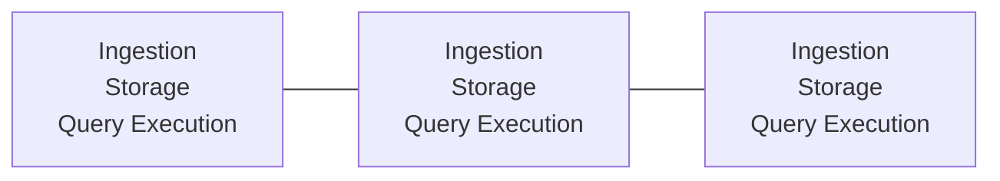
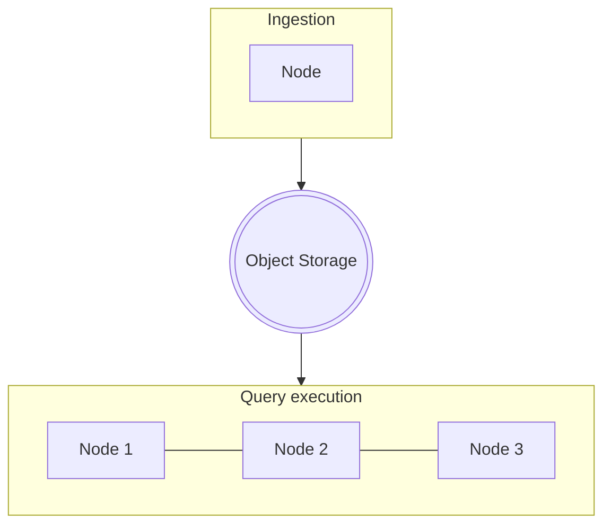
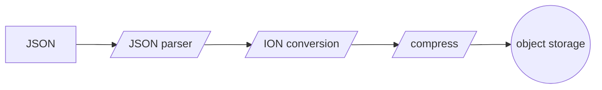

# Sneller cloud-native architecture
Most database engines were designed well before cloud-native architecture become popular. Some engines have been migrated to run in the cloud, but the architecture is often still monolithic.

In the beginning, databases could only scale vertically (adding more CPU power). Vertical scaling is limited, so databases started to scale horizontally (adding more servers). Although the database can scale horizontally, each node typically has the same responsibilities:
1. Ingesting the data.
2. Storing the data.
3. Execute queries on the data.

Each node performs all these tasks:

Direct-attached storage is often used to persist the data. If the node is removed from the cluster, then the data on the node needs to be moved. This adds additional overhead and as clusters grow over time, they becomes increasingly difficult to manage. Operational costs skyrocket and dedicated personnel are required to manage the clusters.

Sneller uses a different approach that fits cloud-native architecture much better. It clearly separates the various aspects of the database.

Each component runs autonomously and can be scaled independently.
1. Ingestion (loading data into the cluster) can run on any node.
2. Persistent data is stored in object storage (i.e. S3 or Minio).
3. Query execution is performed by specialized nodes that typically have a lot of RAM.

This separation has some huge advantages that can reduce operational and maintenance costs significantly.

## Ingestion
Raw JSON in its textual format is not efficient to store and process. That's why Sneller converts all ingested data to a more efficient open format. This format is using open-source technologies ([binary ION](https://amzn.github.io/ion-docs/docs/binary.html) and [Zstandard compression](https://facebook.github.io/zstd/)), so there is no vendor lock-in. Conceptually, it is a compressed row-based binary JSON format.

Ingested data is smaller and can easily be converted back to the original JSON. There is no need to keep the original JSON files, so storage costs are lower. Compressed binary ION is typically 5-30x more space-efficient than raw JSON files.

Sneller is built for performance, so we built a custom-built JSON parser and binary ION writer. Ingestion is fast and efficient, so it can typically run on relatively low-end hardware and has low memory requirements.

The ingestion can easily be extended to supports other formats, such as CSV.

If the data-set is static, the ingestion node can be shut down after all the data has been ingested.

## Persisting to object storage
All persistent data in Sneller is stored in object storage (i.e. S3 or Minio). This has a number of advantages:

1. You get all the benefits of the underlying object storage. AWS S3 provides high availability, security and up to 99.999999999% durability out of the box.
2. No need to scale your database cluster and add expensive nodes when you need additional storage.
3. No loss of data when the database cluster is deleted.
4. No need to learn a new storage technology. Just use the object storage you are already familiar with.

Moving persistent data from the database engine to object storage significantly reduces operational costs and risks. Object storage should be located near the query engine to ensure maximum performance (i.e. same AWS region).

Although Sneller currently only supports AWS S3 (or compatible) object storage, the access-layer is abstracted and can easily be ported to support Azure Blob storage, Google Cloud Storage, ...

## Query execution
Sneller's query execution engine uses AVX-512 to run queries with much higher throughput compared to traditional query engines. Queries can fan-out over multiple nodes with linear scalability. Data is retrieved from object storage and is stored in a transient compressed memory cache on the node to reduce network utilization under load.

AWS provides up to 100Gb/s of bandwidth per EC2 instance and data is fetched in parallel from S3 to fully utilize the available network bandwidth. The data is also compressed, so when data is not in cache it can be loaded quickly and efficiently.

You can scale down (or completely terminate) the query execution nodes when you don't need to query data. No persistent data is stored in the query nodes, so there is no loss of data. Ingestion of new data can still continue, because it runs on separate nodes. This can save even more operational costs, because database nodes are often expensive, due to large amount of RAM.

## Conclusion
Sneller has built a low cost, high performance and highly scalable JSON query engine. We've done this by leveraging object storage for all persistent data. Object storage provides high throughput, high scalability, low cost and excellent reliability and resiliency. Sneller has improved compute efficiency by using AVX-512 vector units in an on-demand scale-out configuration that provides very high compute parallelism. In addition it uses serverless semantics to utilize compute only when it is running queries. Sneller's available cloud based service also improves operational efficiency because ingest and compute are auto-scaled. Unlike other solutions there are no clusters to size, manage and protect.
