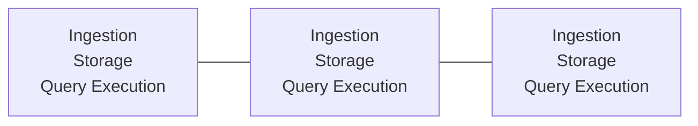
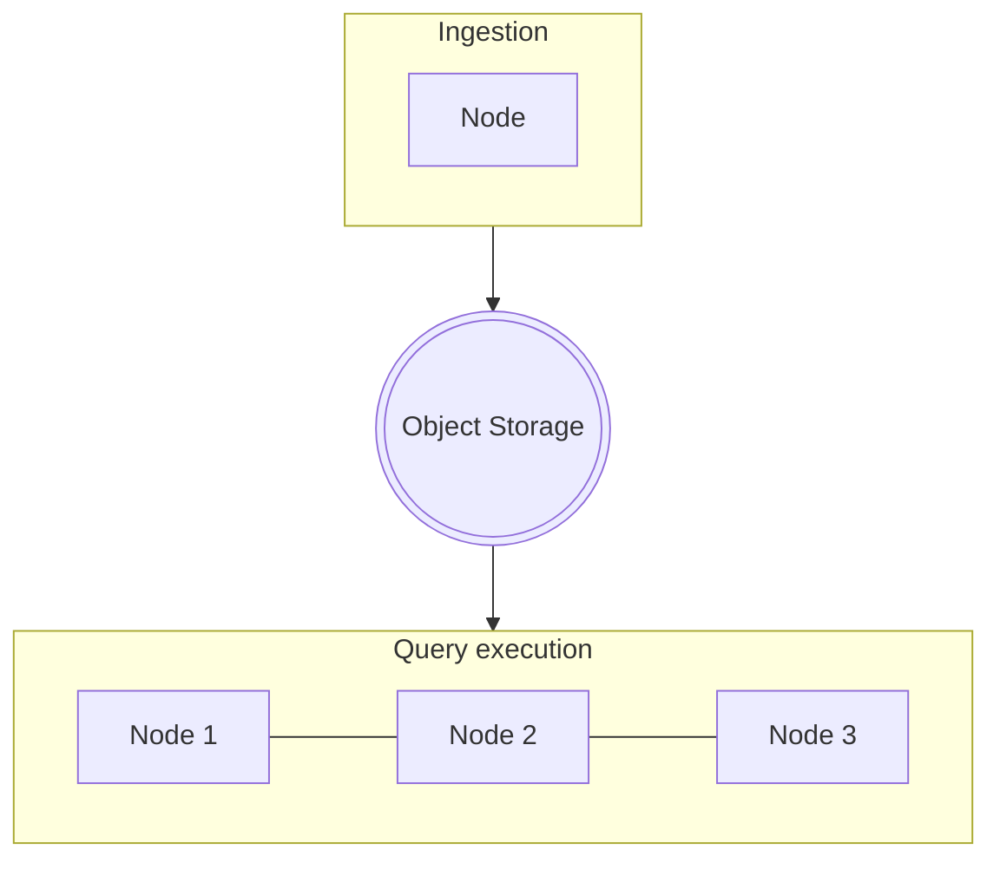
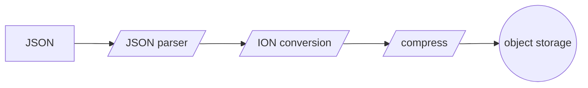

# Sneller cloud-native architecture
Most database engines were designed well before cloud-native architecture become popular. Some engines have been migrated to run in the cloud, but the architecture is often still monolithic.

In the beginning, databases could only scale vertically (adding more CPU power). Vertical scaling is limited, so databases started to scale horizontally (adding more computers). Although the database can scale horizontally, each node typically has the same responsibilities:
1. Ingesting the data.
2. Storing the data.
3. Excute queries on the data.

Each nodes performs all these tasks:

Direct-attached storage is often used to persist the data. If the node is removed from the cluster, so is the data on that node. When clusters grow bigger over time, this becomes increasingly more difficult to manage. Operational costs skyrocket and dedicated personel is required to manage the clusters.

Sneller uses a different approach that fits cloud-native architecture much better. It clearly seperates the various aspects of the database.

Each component runs autonomous and can be scaled independently.
1. Ingestion (loading data into the cluster) can run on any node.
2. Persistent data is stored in object storage (i.e. S3 or Minio).
3. Query execution is performed by specialized nodes that typically have a lot of RAM.

This seperation has some huge advantages that can reduce operational cost and maintenance significantly.

## Ingestion
Raw JSON is not efficient to store and process. That's why Sneller converts all ingested data to a more efficient open format. This format is using open-source technologies ([binary ION](https://amzn.github.io/ion-docs/docs/binary.html) and [Zstandard compression](https://facebook.github.io/zstd/)), so there is no vendor lock-in.

Ingested data is smaller and can easily converted back to the original JSON. There is no need to keep the original JSON files saving a lot of storage costs. Compressed binary ION is typically 5-30x more storage efficient compared to raw JSON files.

Sneller is built for performance, so we built a custom-built JSON parser and binary ION writer. Ingestion is fast and efficient, so it can typically run on relatively low-end hardware and has low memory requirements. We can ingest up to **TODO** MiB/sec on a single **TODO** CPU.

The ingestion also supports ingesting other formats, such as CSV. It can easily be extended to support other formats.

When the data-set is static, then the ingestion node can be removed after all the data has been ingested.

## Persisting to object storage
All persistent data in Sneller is stored in object storage (i.e. S3 or Minio). This has quite some advantages:

1. You get all the benefits of the underlying object storage. AWS S3 provides high availability, security and up to 99.999999999% durability out of the box.
2. No need to scale your database cluster and add expensive nodes, because you need additional storage.
3. No loss of data, when the database cluster is deleted.
4. No need to learn new storage. Just use the object storage you are already familiar with.

Moving persistent data from the database engine to object storage significantly reduce operational costs and risks. To make sure performance is high, the object storage should be located as close to the query engine as possible (i.e. same AWS region).

Although Sneller currently only supports AWS S3 (or compatible), the access-layer is abstracted and can easily be ported to support Azure Blob storage, Google Cloud Storage, ...

## Query execution
Sneller's query execution engine uses AVX-512 to run queries with much higher throughput compared to traditional query engines. Queries can fan-out over multiple nodes with lineair scalability. Data is retrieved from object storage and is stored in a transient compressed memory cache on the node to reduce network bandwidth.

AWS provides up to 100Gb/s networking speed and data is fetched in parallel from S3 to fully utilize the available network bandwidth. Even if data is not in cache, then it can be loaded fast and efficient.

You can scale down (or complete terminate) the query execution nodes, when you don't need to query data.No persistent data is stored in the query nodes, so there is no loss of data. Ingestion of new data can still continue, because it runs on seperate nodes. This can save even more operational costs, because database nodes are often expensive, due to large amount of RAM.